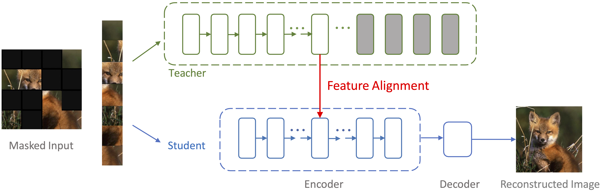

## Masked Autoencoders Enable Efficient Knowledge Distillers


This is a PyTorch implementation of the [DMAE paper](https://arxiv.org/abs/2208.12256).

<div align="center">
  
</div>


### Preparation

Install PyTorch and ImageNet dataset following the [official PyTorch ImageNet training code](https://github.com/pytorch/examples/tree/master/imagenet). Please refer to [MAE official codebase](https://github.com/facebookresearch/mae) for other enrironment requirements.


### Pre-Training

This implementation only supports **multi-gpu**, **DistributedDataParallel** training, which is faster and simpler; single-gpu or DataParallel training is not supported.

To pre-train models in a 4-gpu machine, please first download the [ViT-Large model](https://drive.google.com/drive/folders/1tCdXhi_pWbRSgdUcmyOyP5mE0GMnpeC9?usp=sharing) as the teacher model, and put it into the teacher_model folder. Then:

Baseline: To pre-train models with 1 Teacher in a 4-gpu machine, run:
```
bash scripts/pretrain_my_CIFAR10.sh
```

Experiment: To pre-train models with 2 Same Teachers in a 4-gpu machine, run:
```
bash scripts/pretrain_my_CIFAR10_2sameT.sh
```


### Finetuning
Baseline: To finetune models with 1 Teacher in a 4-gpu machine, run:

```
bash scripts/finetune_my_CIFAR10.sh
```

Experiment: To finetune models with 2 Same Teachers in a 4-gpu machine, run:

```
bash scripts/finetune_my_CIFAR10_2sameT.sh
```


Below are from the original repository:

### Models

The checkpoints of our pre-trained and finetuned ViT-Base on ImageNet-1k can be downloaded as following:


|             |                                          Pretrained Model                                           | Epoch | 
| ----------- | :-------------------------------------------------------------------------------------------------: | :------: 
| ViT-Base   | [download link](https://drive.google.com/drive/folders/1tCdXhi_pWbRSgdUcmyOyP5mE0GMnpeC9?usp=sharing) |   100   | 


|             |                                          Finetuned Model                                           | Acc | 
| ----------- | :-------------------------------------------------------------------------------------------------: | :------: 
| ViT-Base   | [download link](https://drive.google.com/drive/folders/1tCdXhi_pWbRSgdUcmyOyP5mE0GMnpeC9?usp=sharing) |   84.0   | 


### License

This project is under the CC-BY-NC 4.0 license. See [LICENSE](LICENSE) for details.


### Acknowledgment

This work is partially supported by TPU Research Cloud (TRC) program, and Google Cloud Research Credits program.


### Citation

```
@inproceedings{bai2022masked,
  title     = {Masked autoencoders enable efficient knowledge distillers},
  author    = {Bai, Yutong and Wang, Zeyu and Xiao, Junfei and Wei, Chen and Wang, Huiyu and Yuille, Alan and Zhou, Yuyin and Xie, Cihang},
  booktitle = {CVPR},
  year      = {2023}
}
```
